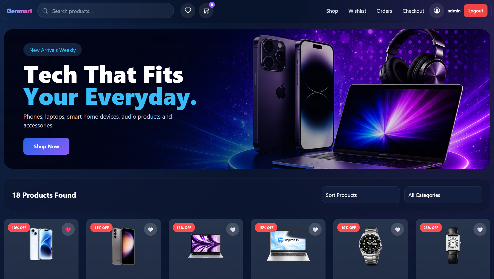
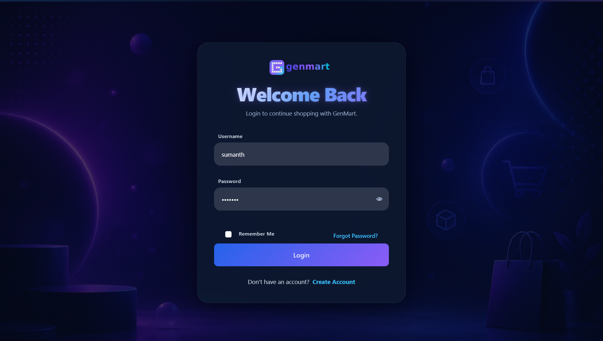
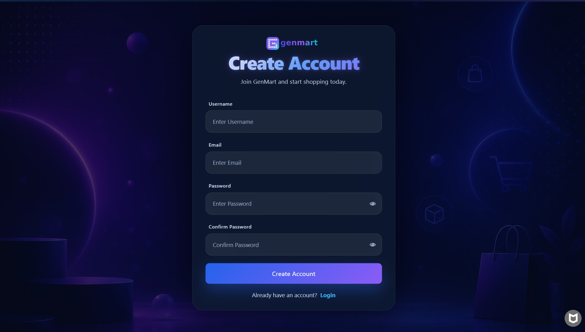
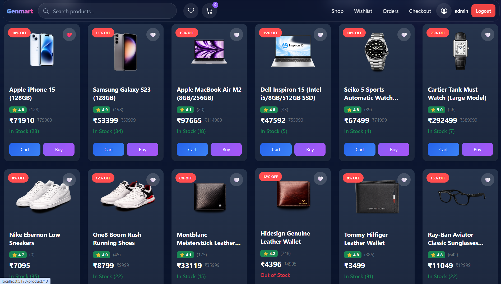
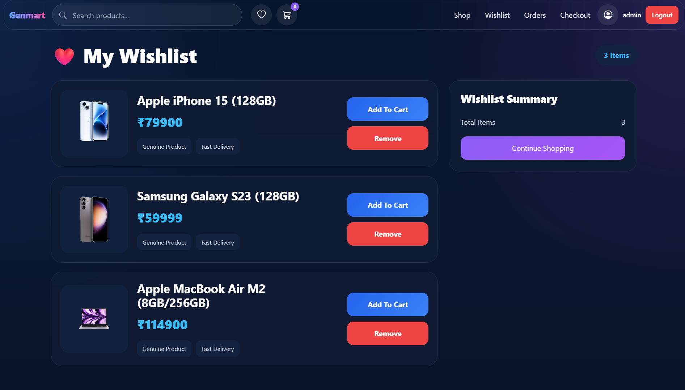
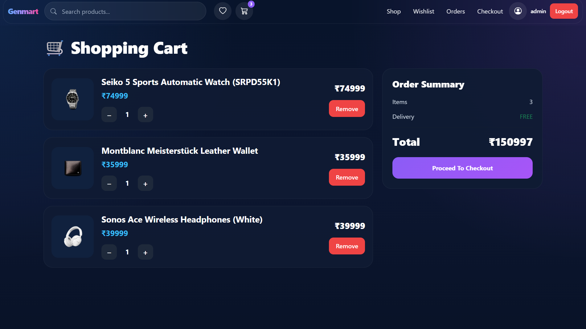
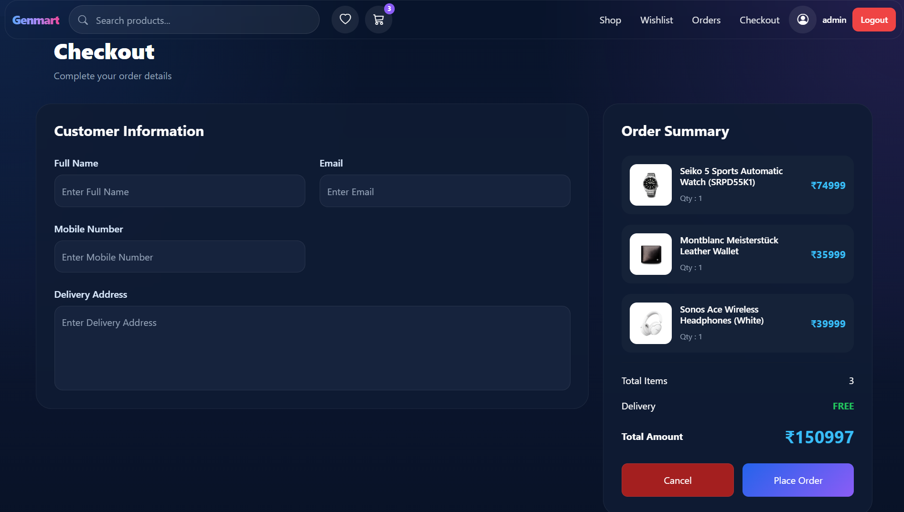

# 🛒 GenMart Frontend

GenMart is a responsive React-based E-Commerce application featuring JWT Authentication, Product Listing, Wishlist, Cart, Checkout, and seamless integration with the Django REST API backend.

---

# 🚀 Live Demo

### Frontend

https://gen-mart-frontend.vercel.app/

### Backend API

https://genmart-backend-production.up.railway.app/

---

# 📸 Screenshots

## Home Page



---

## Login



---

## Register



---

## Product Listing



---

## Wishlist



---

## Cart



---

## Checkout



---

# ✨ Features

- User Registration
- User Login
- JWT Authentication
- Responsive UI
- Product Listing
- Search Products
- Product Details
- Wishlist
- Shopping Cart
- Checkout
- Protected Routes
- Hero Banner
- Context API
- Modern UI Design

---

# 🛠 Tech Stack

- React
- React Router
- Axios
- Context API
- CSS Modules
- JavaScript
- Vite
- Vercel

---

# 📂 Project Structure

```
GenMart-Frontend
│
├── src
├── public
├── screenshots
│   ├── home.png
│   ├── login.png
│   ├── register.png
│   ├── products.png
│   ├── wishlist.png
│   ├── cart.png
│   └── checkout.png
│
├── package.json
├── vite.config.js
└── README.md
```

---

# ⚙ Installation

```
git clone https://github.com/YourUsername/GenMart-Frontend.git

cd GenMart-Frontend

npm install

npm run dev
```

---

# 🔧 Environment Variable

Create

```
.env
```

```
VITE_API_URL=https://genmart-backend-production.up.railway.app
```

---

# 🌐 Deployment

Frontend deployed using **Vercel**.

Backend deployed using **Railway**.

Images hosted on **AWS S3**.

---

# 🔗 Backend Repository

Connects to the Django REST Backend.

---

# 👨‍💻 Author

** G Sumanth **
